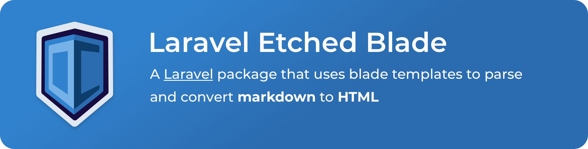

[](https://codecov.io/gh/olliecodes/laravel-etched-blade)
[](https://travis-ci.com/olliecodes/laravel-etched-blade)

## Install

Install via composer.

```bash
$ composer require olliecodes/laravel-etched-blade
```

Once installed you'll want to publish the config.

```bash
$ php artisan vendor:publish --provider="\OllieCodes\Etched\EtchedServiceProvider" --tag=config
```

If you want to modify the default themes you can publish those too.

```bash
$ php artisan vendor:publish --provider="\OllieCodes\Etched\EtchedServiceProvider" --tag=views
```

### Requirements

This package requires the following;

 - PHP >= 7.3 (Including 8).
 - `illuminate/view` >= 8.0 < 9.0 - The view component from Laravel.
 - `league/commonmark` >= 1.6 < 2.0 - The PHP league commonmark library, used for parsing the Markdown.
 - `webuni/front-matter` >= 1.2 < 2.0 - The front matter parser.

## Usage

To render markdown in your blade files you can either do it inline;

```blade
@etched
# I am a heading

This is some content

 - I am a list
   - So am I but more
   - I'm the same
 - I'm less than those two
@endetched
```

Or by including a markdown file (`.md`)

```blade
@include('markdown.content.article-1')
```

The above references the file `markdown/content/article-1.md`, and the file will
be rendered by etched the same way that blade files normally are.

### Themes
You can control the theme used for the rendered markdown in several ways.

Provide it as an argument on the directive.

```blade
@etched('simple')
...
@endetched
```

As an argument when including.

```blade
@include('markdown-file', ['theme' => 'simple'])
```

Or in the front-matter of the markdown.

```markdown
---
theme: simple
---

I am some content
```

If no theme is provided the value of `etched.defaults.theme` is used instead. If
multiple are provided, the value from the front-matter will take precedence.

### Advanced

All markdown rendering is handled by the `OllieCodes\Etched\Etched::render()` method.

You can use this method on an instance of `Etched`

```php
app(\OllieCodes\Etched\Etched::class)->render($content, $theme);
```

Or using the facade.

```php
\OllieCodes\Etched\Facades\Etched::render($content, $theme);
```

The second parameter `$theme` is optional and will default to the config value 
`etched.defaults.theme`. The theme will be overridden by the front-matter value
if one is provided in the markdown content.